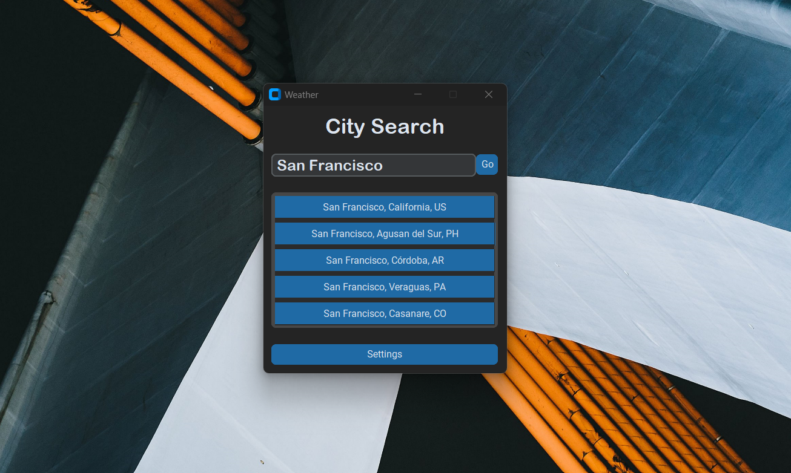
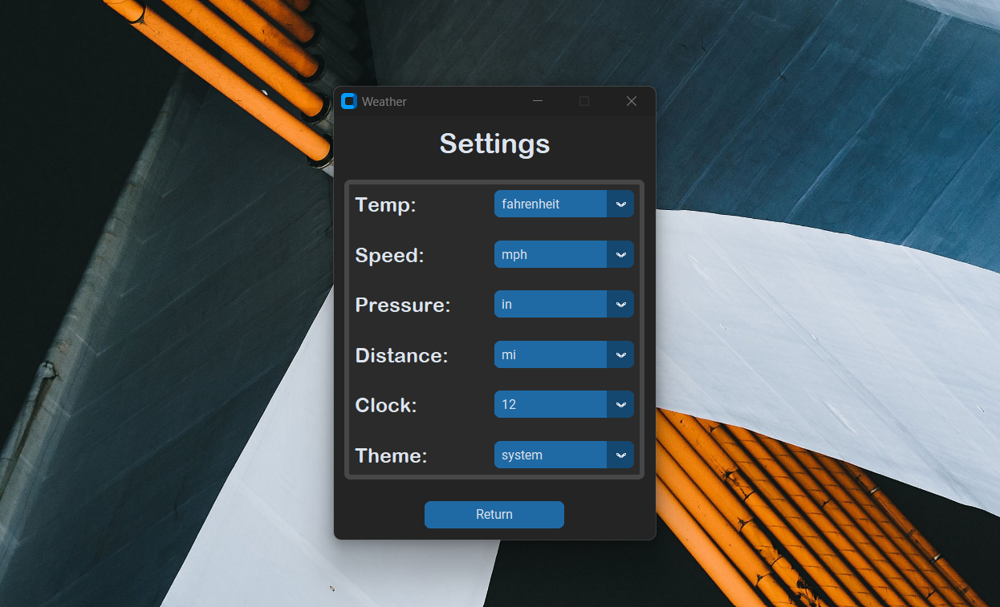
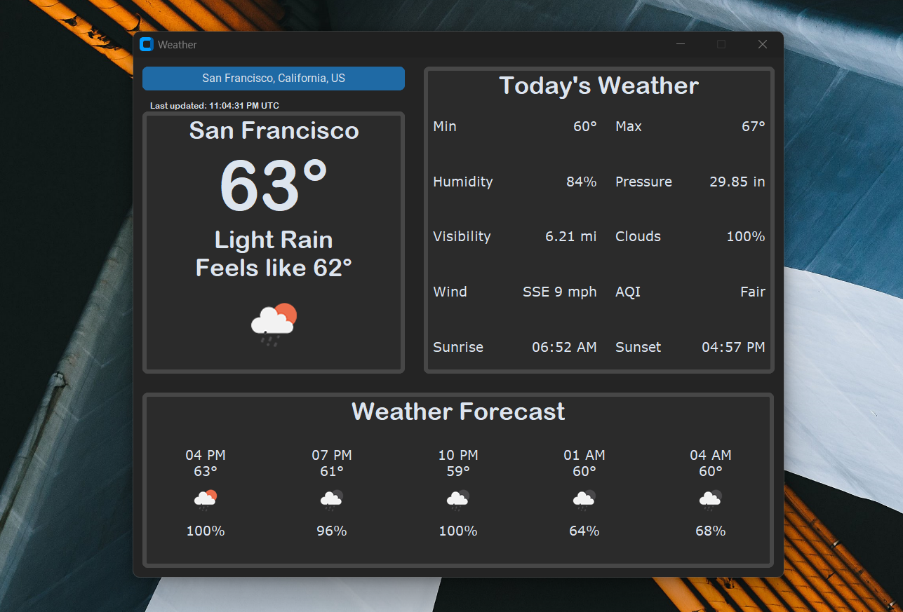

# Weather App

## Description

This is a Python desktop application that provides users with the ability to search for weather information for a specific city. The app displays current weather conditions and forecasted data while also allowing users to customize units of measurement and color theme based on their preferences.

## Features

- **City Search:** Users can easily search for the weather information of any city.
- **Current and Forecasted Weather:** The app retrieves and displays both current and forecasted weather conditions.
- **Customization:** Users can customize units of measurement (e.g., temperature in Celsius or Fahrenheit) and choose a color theme that suits their preference.
- **Modern GUI:** The app features a modern graphical user interface created using the CustomTkinter library.
- **OpenWeatherMap API:** Utilizes the OpenWeatherMap API to obtain accurate and up-to-date weather data.

## Screenshots





## API Key

To use the OpenWeatherMap API, you'll need to obtain an API key. Follow the instructions [here](https://openweathermap.org/appid) to get your API key. Once obtained, add it to line 50 of the `main.py` file.

```python
  # API KEY
  self.api_key = "PASTE_YOUR_API_KEY_HERE"
```

## Installation

To run the application, follow these steps:

1. Clone this repository: `git clone https://github.com/joewil08/WeatherApp.git`
2. Obtain and paste your API key using the above instructions
3. Navigate to the project directory: `cd WeatherApp`
4. Install dependencies: `pip install -r requirements.txt`
5. Run the app: `python main.py`

## Usage

1. Launch the application by running `main.py`.
2. Click the "Settings" button to customize the units of measurement and color theme as per your preference and click "Return" when done.
3. Enter the name of the city you want to check the weather for in the search bar and press the "Enter" key or click the "Go" button.
4. Click a city from the list to retrieve and display the weather information.
5. Explore the current conditions and forecasted data for the selected city.
6. Click the city name on the top left to return to the search menu.

## CustomTkinter

The CustomTkinter library is used to create the modern GUI.

Click [here](https://github.com/tomschimansky/customtkinter) to view the CustomTkinter repository.
